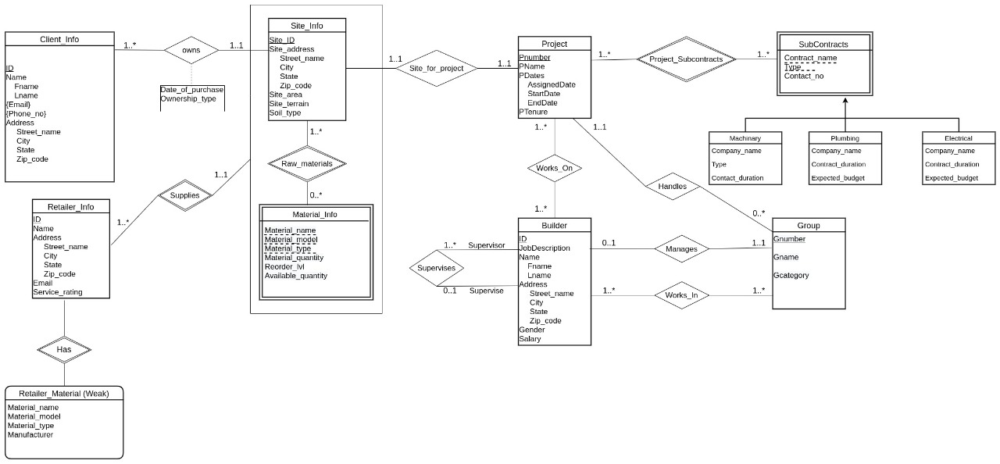
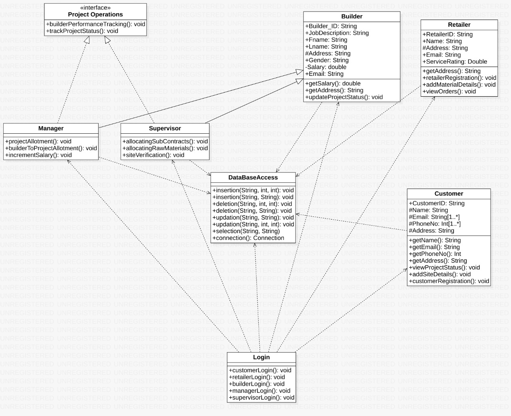
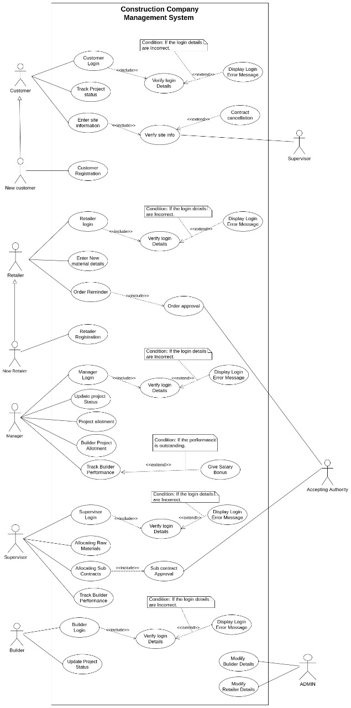
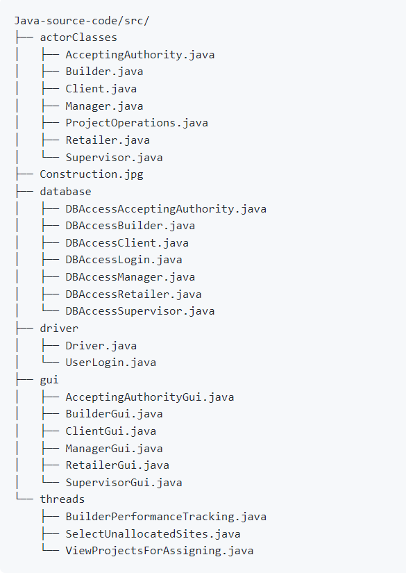

# Construction Company Management System

## Overview

🏗️ The **Construction Company Management System** is a comprehensive software solution designed to streamline the management of construction projects, operations, and finances. It provides features for project tracking, resource management, financial tracking, and more, all within a user-friendly interface. This system aims to improve the efficiency and organization of construction companies, ensuring seamless management of multiple projects and resources.

---

## Features 🏆

### 1. **Project Management:**
   - Create and manage multiple construction projects.
   - Track project progress, milestones, and deadlines.
   - Monitor task assignments and completion status.

### 2. **Resource Management:**
   - Manage resources like labor, equipment, and materials.
   - Allocate and track resources across different projects.
   - View resource availability and usage statistics.

### 3. **Financial Management:**
   - Track project costs and budgets.
   - Generate financial reports and track expenditures.
   - Record and monitor invoices, payments, and other financial transactions.

### 4. **Employee Management:**
   - Manage employee records and roles.
   - Track hours worked, payroll, and employee performance.
   - Generate reports for employee work schedules and task assignments.

### 5. **Dashboard & Reports:**
   - Overview of ongoing projects, budgets, and resources.
   - Generate various reports such as progress, financial, and resource allocation reports.










---

## Technologies Used 🛠️

✔️ **Frontend:**  
   - **Java Swings** for building the graphical user interface (GUI).

✔️ **Backend:**  
   - **Java** for the core system development.
   - **PostgreSQL** for database management and storing project and employee data.

✔️ **Additional Tools:**  
   - **Database Design:** Entity-Relationship (ER) diagram design for the system database structure.
   - **Database Normalization:** Ensured efficient data storage and retrieval by applying normalization techniques.

---

## Key Features 🚀

- **User Authentication:** Secure login and authentication for admins and employees.
- **Multi-User Support:** Support for different user roles (admin, employee) to manage different aspects of the system.
- **Project and Task Tracking:** Detailed tracking of tasks, deadlines, and milestones for construction projects.
- **Resource Allocation:** Track and manage resources (labor, equipment, materials) across projects.
- **Real-Time Data Updates:** Real-time data updates and notifications for project managers and team members.
- **Use Case Analysis:** Detailed system requirements gathering to ensure smooth user interaction.

---

## Project Milestones 📅

- **System Development**: The system was developed within a 4-month timeline, from requirements gathering to implementation.
- **ER Diagram Design**: The database was modeled with over 10 entities to efficiently handle construction data.
- **Use Case Analysis**: Extensive use case analysis to define system functionalities and ensure a user-friendly interface.

---

## Installation & Usage 🛠️

To get started with the **Construction Company Management System**, clone this repository and install the necessary dependencies.

### Clone the Repository

```bash
git clone https://github.com/vmadd24/Construction-Company-Management-System.git
cd Construction-Company-Management-System
